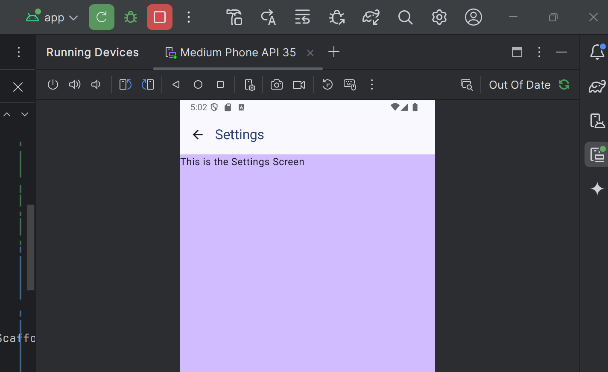

# NativeTechnologies
Used for Weekly labs and assignments
https://github.com/annnnnne0811/NativeTechnologies

# Labs 
- > Week 2, BMI  : 
- > Week 3, LoginForm : https://github.com/annnnnne0811/NativeTechnologies/blob/master/LoginForm/app/src/main/java/com/example/form/MainActivity.kt
- > Week 4, Theme: https://github.com/annnnnne0811/NativeTechnologies/tree/master/Theming
  - > The app in light and dark mode:
<table>
<tr>
  <td> </td>
  <td></td>
</tr>
</table>

- > Week 5, Walkthrough Calories  : https://github.com/annnnnne0811/NativeTechnologies/tree/master/WalkthroughCalories 
  - > App before and after filling in input fields:
  <table>
  <tr>
  <td> </td>
  <td></td>
  </tr>
  </table>

- > Week 6, Walkthrough Scaffold and Navigation: https://github.com/annnnnne0811/NativeTechnologies/tree/master/WalkthroughScaffoldNavigation 
  - > Showing the different screens
    <table>
<tr>
  <td> </td>
  <td></td>
  <td></td>
</tr>
    </table>

- > Week 7, BMI calculator: 

# Assignments

