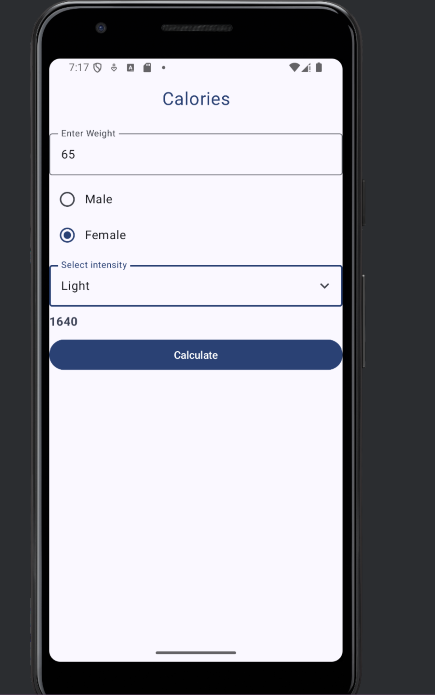

# NativeTechnologies
Used for Weekly labs and assignments
https://github.com/annnnnne0811/NativeTechnologies

# Labs 
- > Week 2, BMI  : 
- > Week 3, LoginForm : https://github.com/annnnnne0811/NativeTechnologies/blob/master/LoginForm/app/src/main/java/com/example/form/MainActivity.kt
- > Week 4, Theme: https://github.com/annnnnne0811/NativeTechnologies/tree/master/Theming
- The app in light mode: 

- The app in dark mode:

- > Week 5, Walkthrough Calories  : https://github.com/annnnnne0811/NativeTechnologies/tree/master/WalkthroughCalories 
- >  App before filling in input fields:
  
-
- > App after running after filling input fields:
  

  

# Assignments

