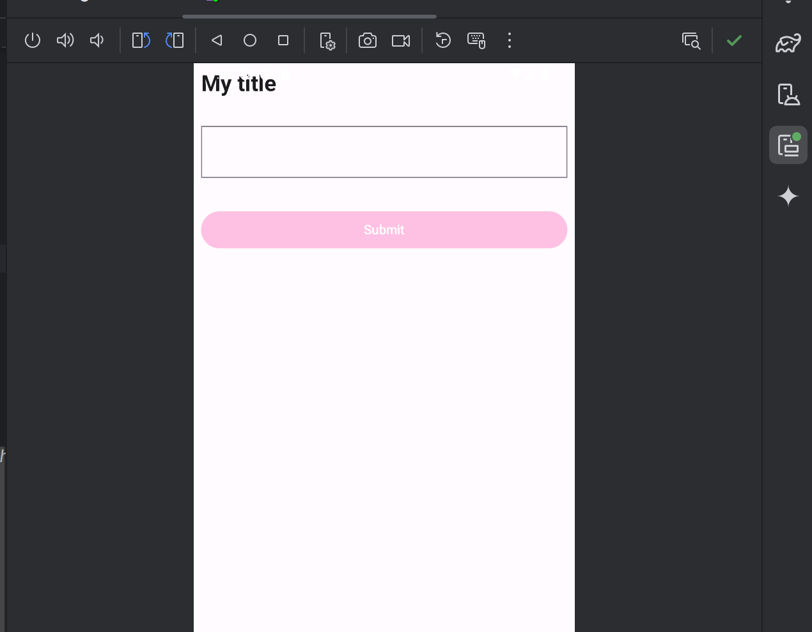

# NativeTechnologies
Used for Weekly labs and assignments 

# Labs 
- > Week 2, BMI : 
- > Week 3, LoginForm : https://github.com/annnnnne0811/NativeTechnologies/blob/master/LoginForm/app/src/main/java/com/example/form/MainActivity.kt
- > Week 4, Theme: https://github.com/annnnnne0811/NativeTechnologies/tree/master/Theming
 - The app in light mode:

# The app in dark mode:

# Assignments

